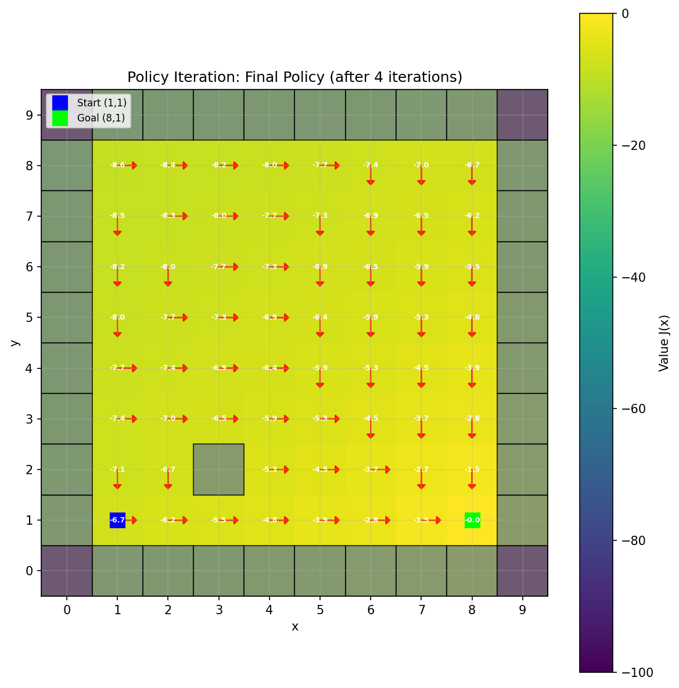
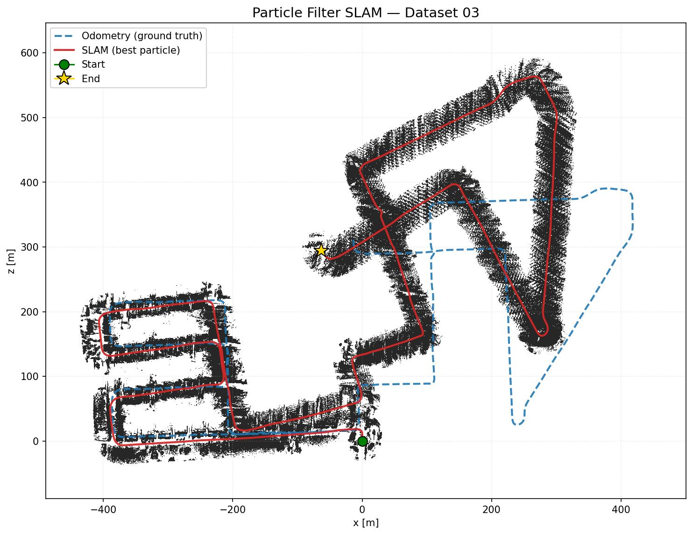
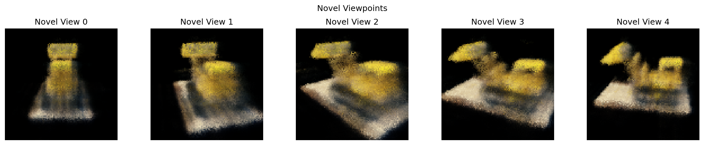
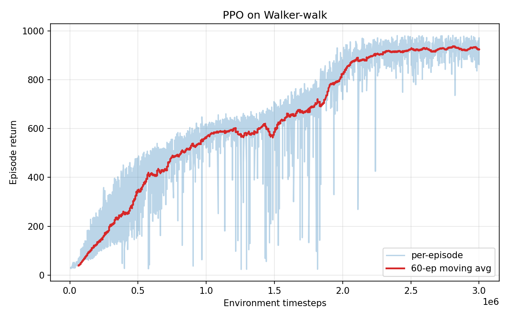
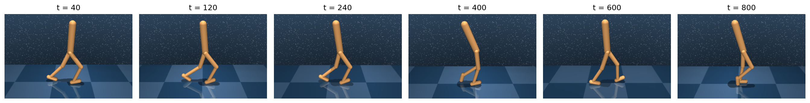

# ESE 650: Learning in Robotics

**University of Pennsylvania · Spring 2025**

This repository contains my homework solutions, lecture notes, and final project for ESE 650 — Learning in Robotics, a graduate course covering probabilistic state estimation, optimal control, and reinforcement learning for robotic systems.

---

## Course Overview

The course is organized into three modules (per the Ch. 7 intro):

1. **State Estimation** — Bayesian filtering, HMMs, Kalman / particle filters, SO(3) geometry & quaternions
2. **Optimal Control** — Dynamic programming, Dijkstra, value/policy iteration, LQR, HJB, iLQR, MPC
3. **Reinforcement Learning** — Imitation learning, policy gradient (REINFORCE → PPO), Q-learning (DQN, DDPG), offline RL, inverse RL, RLHF

See [`lec/`](lec/) for module-organized lecture notes and per-chapter cheatsheets.

---

## Homework Index

### [Homework 1](hw1/) — Bayesian Filtering & Hidden Markov Models

| Problem | Topic | Key Methods |
|---------|-------|-------------|
| [P1](hw1/p1/) | 2-D Histogram Filter | Grid-based Bayes filter, belief propagation |
| [P2](hw1/p2/) | Hidden Markov Model | Forward-backward algorithm, ξ derivation |
| [P3](hw1/p3/) | HMM Derivations | Baum-Welch, EM for parameter estimation |
| [P4](hw1/p4/) | HMM Applications | Viterbi, posterior decoding |

<p align="center">
  
  &nbsp;&nbsp;
  
  <br><em>Belief state: early (left) vs converged (right)</em>
</p>

---

### [Homework 2](hw2/) — Kalman Filtering for State Estimation

| Problem | Topic | Key Methods |
|---------|-------|-------------|
| [P1](hw2/p1/) | Extended Kalman Filter | Augmented state, parameter estimation |
| [P2](hw2/p2/) | Unscented Kalman Filter | Quaternion UKF, IMU orientation tracking |

**Highlights:**
- EKF recovers unknown system parameter $\hat{a} = -1.0008 \pm 0.0104$ (true $a = -1$) from 100 nonlinear observations
- QUKF tracks 3-D orientation of a quadrotor from IMU data; validated against Vicon motion capture
- Full sensor calibration pipeline: stationary-window bias estimation + $W_z$ scale correction
- All 3 test datasets pass autograder thresholds at 100% credit level

<p align="center">
  
  <br><em>EKF: estimated parameter μ_k ± σ_k converges to true a = −1</em>
</p>

<p align="center">
  
  <br><em>UKF quaternion tracking vs Vicon ground truth (Dataset 1)</em>
</p>

| Dataset | Roll RMSE | Pitch RMSE | Yaw RMSE |
|---------|:---------:|:----------:|:--------:|
| 1 | 0.699 | 0.233 | 0.721 |
| 2 | 0.426 | 0.293 | 0.475 |
| 3 | 0.094 | 0.078 | 0.332 |

---

### [Homework 3](hw3/) — MDPs, SLAM & Neural Radiance Fields

| Problem | Topic | Key Methods |
|---------|-------|-------------|
| [P1](hw3/p1/) | Policy Iteration | Bellman recursion on a 10×10 grid MDP |
| [P2](hw3/p2/) | Particle-Filter SLAM | KITTI LiDAR, occupancy mapping, log-odds |
| [P3](hw3/p3/) | Neural Radiance Fields | Volume rendering, positional encoding, novel-view synthesis |

**Highlights:**
- Policy iteration converges in 4 sweeps on the gridworld (see `hw3/p1/part_c_iteration_*.png`)
- Particle-filter SLAM on a KITTI sequence — 2-D occupancy map built from LiDAR scans + odometry
- NeRF trained on a synthetic Lego scene; renders novel views from `transforms_colmap.json`

<p align="center">
  
  &nbsp;&nbsp;
  
  &nbsp;&nbsp;
  
  <br><em>Policy iteration final (left) · PF-SLAM map (mid) · NeRF novel views (right)</em>
</p>

Reports: [`hw3/p1/policy_iteration_report.pdf`](hw3/p1/policy_iteration_report.pdf) · [`hw3/p2/pf_slam_report.pdf`](hw3/p2/pf_slam_report.pdf) · [`hw3/p3/nerf_report.pdf`](hw3/p3/nerf_report.pdf) · combined [`hw3/report/main.pdf`](hw3/report/main.pdf)

---

### [Homework 4](hw4/) — Deep Reinforcement Learning

| Problem | Topic | Key Methods |
|---------|-------|-------------|
| [P1](hw4/p1/) | Written (DP-RL bridge) | Bellman / VI / PI, REINFORCE, DAgger derivations |
| [P2](hw4/p2/) | PPO on DM-Control `walker` | GAE-λ, mirror-symmetry regularizer, value clipping |

**Highlights:**
- PPO trained on the DeepMind Control `walker` task with the standard stabilizer stack: orthogonal init, running obs normalization (mirror-symmetrized), GAE-λ, mini-batch SGD, LR annealing, entropy bonus, value clipping, grad clipping
- Left/right mirror-symmetry regularizer applied to both π and V

<p align="center">
  
  <br><em>PPO learning curve on DM-Control walker</em>
</p>

<p align="center">
  
  <br><em>Walker rollouts at training steps 40 → 800</em>
</p>

Report: [`hw4/hw4_report.pdf`](hw4/hw4_report.pdf)

---

### [Final Project](proj/) — ESE 546

See [`proj/ESE546_Final_Project.pdf`](proj/ESE546_Final_Project.pdf) for the final project report.

---

## Lecture Notes

[`lec/`](lec/) contains lecture slides, per-chapter cheatsheets, and practice problems, organized into the three course modules. See [`lec/README.md`](lec/README.md) for the chapter index.

---

## Repository Structure

```
Learning-in-Robotics/
├── hw1/   Bayesian filtering & HMM (p1–p4)
├── hw2/   Kalman filtering — EKF (p1) & quaternion UKF (p2)
├── hw3/   Policy iteration (p1), PF-SLAM on KITTI (p2), NeRF (p3)
├── hw4/   Written DP-RL bridge (p1), PPO on DM-Control walker (p2)
├── lec/   Lecture notes by module (01_estimation, 02_control, 03_rl, review)
└── proj/  ESE 546 final project
```

---

## Running the Code

All Python scripts are standalone — no build system or virtual environment. Run each script from its own directory (paths are relative). See [`CLAUDE.md`](CLAUDE.md) for per-homework dependencies and dataset requirements.

```bash
cd hw2/p2 && python estimate_rot.py
cd hw3/p2 && python main.py
cd hw3/p3 && python NeRF.py
cd hw4/p2 && py -3.10 18330723_hw4_p2.py   # hw4/p2 needs Python 3.10 (dm_control)
```

External datasets not committed (must be obtained separately):
- `hw3/p2/KITTI/` — KITTI LiDAR `.bin` files + poses
- `hw3/p3/data/images/` — Lego synthetic NeRF training images

---

## Dependencies

| HW | Adds |
|----|------|
| hw1, hw2 | `numpy`, `scipy`, `matplotlib`, `jupyter` |
| hw3/p2   | + `tqdm`, `click` |
| hw3/p3   | + `torch`, `opencv-python`, `imageio` |
| hw4/p2   | + `torch`, `dm_control` (MuJoCo, Python 3.10) |
