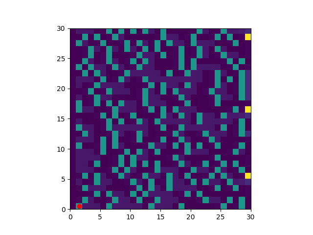
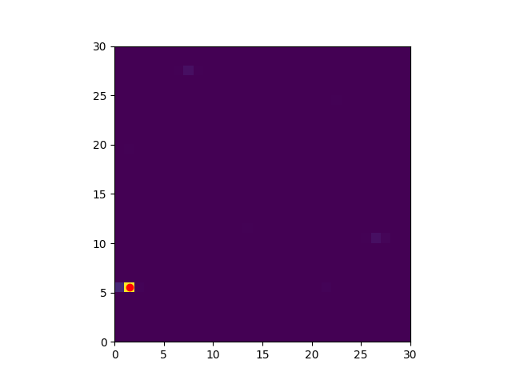
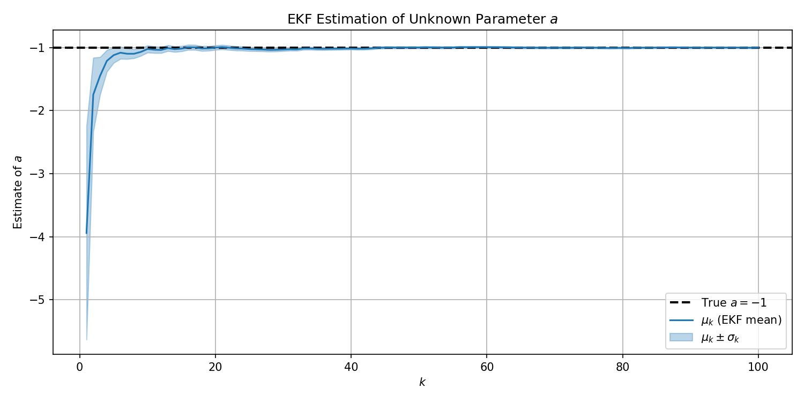
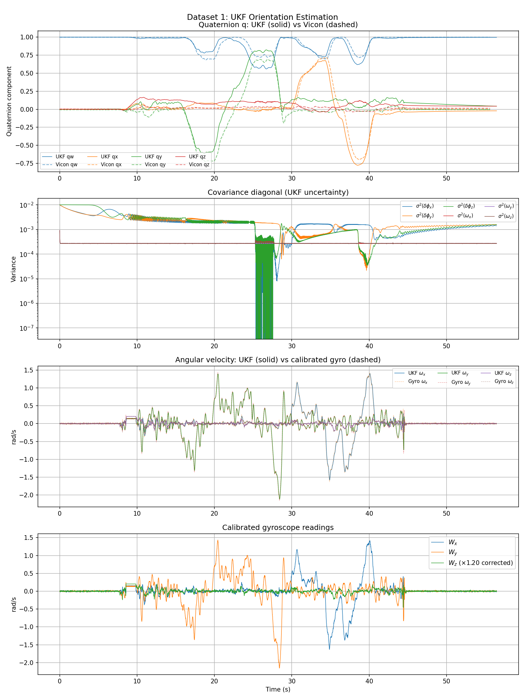

# ESE 650: Learning in Robotics

**University of Pennsylvania · Spring 2025**

This repository contains my homework solutions for ESE 650 — Learning in Robotics, a graduate course covering probabilistic state estimation, filtering, and learning algorithms for robotic systems.

---

## Course Overview

The course focuses on the mathematical foundations of learning and inference in robotics, including:

- Bayesian filtering (Histogram, Kalman, Particle filters)
- Hidden Markov Models and the EM algorithm
- Unscented transforms and nonlinear estimation
- Quaternion-based 3-D orientation tracking

---

## Homework Index

### [Homework 1](hw1/) — Bayesian Filtering & Hidden Markov Models

| Problem | Topic | Key Methods |
|---------|-------|-------------|
| [P1](hw1/p1/) | 2-D Histogram Filter | Grid-based Bayes filter, belief propagation |
| [P2](hw1/p2/) | Hidden Markov Model | Forward-backward algorithm, ξ derivation |
| [P3](hw1/p3/) | HMM Derivations | Baum-Welch, EM for parameter estimation |
| [P4](hw1/p4/) | HMM Applications | Viterbi, posterior decoding |

**Highlights:**
- `histogram_filter.py` — full 2-D grid filter with motion and sensor models
- Belief state visualisation: from diffuse prior → converged to ground truth

<p align="center">
  
  &nbsp;&nbsp;
  
  <br><em>Belief state: early (left) vs converged (right)</em>
</p>

---

### [Homework 2](hw2/) — Kalman Filtering for State Estimation

| Problem | Topic | Key Methods |
|---------|-------|-------------|
| [P1](hw2/p1/) | Extended Kalman Filter | Augmented state, parameter estimation |
| [P2](hw2/p2/) | Unscented Kalman Filter | Quaternion UKF, IMU orientation tracking |

**Highlights:**
- EKF recovers unknown system parameter $\hat{a} = -1.0008 \pm 0.0104$ (true $a = -1$) from 100 nonlinear observations
- QUKF tracks 3-D orientation of a quadrotor from IMU data; validated against Vicon motion capture
- Full sensor calibration pipeline: stationary-window bias estimation + $W_z$ scale correction
- All 3 test datasets pass autograder thresholds at 100% credit level

<p align="center">
  
  <br><em>EKF: estimated parameter μ_k ± σ_k converges to true a = −1</em>
</p>

<p align="center">
  
  <br><em>UKF quaternion tracking vs Vicon ground truth (Dataset 1)</em>
</p>

| Dataset | Roll RMSE | Pitch RMSE | Yaw RMSE |
|---------|:---------:|:----------:|:--------:|
| 1 | 0.699 | 0.233 | 0.721 |
| 2 | 0.426 | 0.293 | 0.475 |
| 3 | 0.094 | 0.078 | 0.332 |

---

## Repository Structure

```
Learning-in-Robotics/
├── hw1/
│   ├── p1/          2-D histogram filter
│   ├── p2/          HMM forward-backward & ξ derivation
│   ├── p3/          Baum-Welch EM (Jupyter notebooks)
│   └── p4/          Viterbi & posterior decoding (Jupyter notebooks)
└── hw2/
    ├── p1/          EKF for parameter estimation
    ├── p2/          UKF for 3-D orientation (IMU + Vicon data)
    ├── docs/        Assignment PDFs & reference materials
    └── report/      LaTeX report + compiled PDF
```

---

## Dependencies

```
numpy  scipy  matplotlib  jupyter
```

---

## Notes

- Written solutions and derivations are in the `report/` folders and `.txt`/`.ipynb` files
- IMU and Vicon sensor data (`.npy`) are included for reproducibility
- All filtering code is self-contained and runnable with the included data
