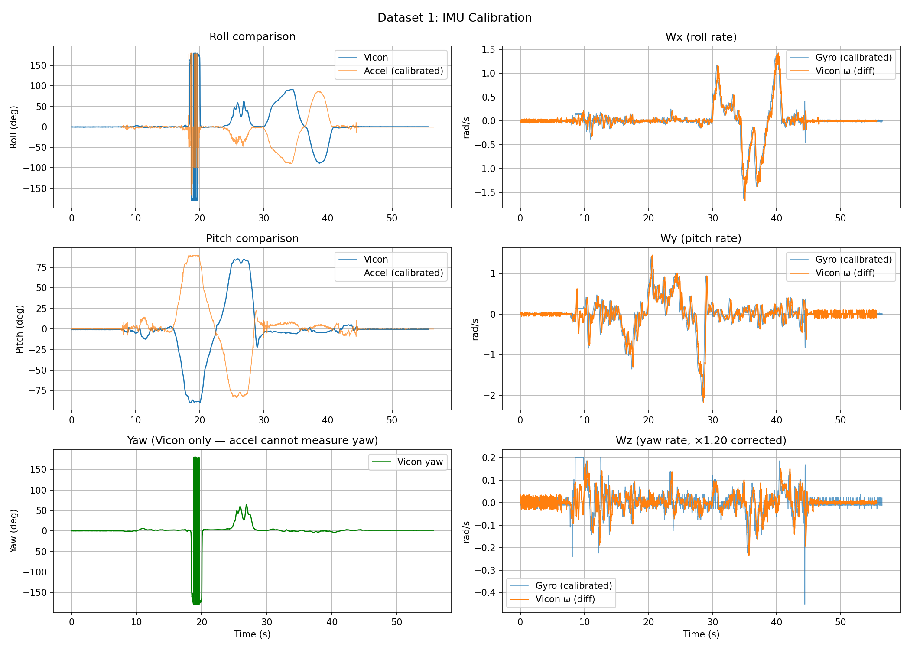

# Homework 2 — Kalman Filtering for State Estimation

**ESE 650: Learning in Robotics** · University of Pennsylvania · Spring 2025

This homework implements two Kalman filter variants applied to real and simulated estimation problems.

---

## Problem 1 · Extended Kalman Filter (EKF)

**Goal:** Estimate an unknown system parameter $a$ from noisy observations of a nonlinear dynamical system.

$$x_{k+1} = a\,x_k + \epsilon_k, \qquad y_k = \sqrt{x_k^2 + 1} + \nu_k$$

**Approach:**
- Augment the state to $z_k = [x_k,\; a]^\top$ so the EKF jointly estimates the state and the unknown parameter
- Derive the process Jacobian $F_k$ and measurement Jacobian $H_k$ analytically
- Key insight: $h(x) = \sqrt{x^2+1}$ is an even function — the EKF must be initialised with the correct sign of $a$ to converge to the right mode

**Result:** After 100 observations the EKF recovers $\hat{a} = -1.0008 \pm 0.0104$ (true value $a = -1$).

| File | Description |
|------|-------------|
| [`p1/18330723_hw2_p1a.py`](p1/18330723_hw2_p1a.py) | Simulate the system, generate dataset $D$ |
| [`p1/18330723_hw2_p1b.py`](p1/18330723_hw2_p1b.py) | EKF implementation |
| [`p1/18330723_hw2_p1c.py`](p1/18330723_hw2_p1c.py) | Plot $\mu_k \pm \sigma_k$ vs true $a$ |

<p align="center">
  
  <br><em>EKF mean ± 1σ converges to the true parameter within ~10 observations</em>
</p>

---

## Problem 2 · Unscented Kalman Filter (UKF) for 3-D Orientation

**Goal:** Track the orientation of a quadrotor in 3-D using noisy IMU data (accelerometer + gyroscope), validated against a Vicon motion-capture system.

### Sensor Calibration

Raw IMU readings have large biases ($|\beta_\text{accel}| \approx 45\ \text{m/s}^2$, $|\beta_\text{gyro}| \approx 5\text{–}6\ \text{rad/s}$).
Calibration uses a stationary window (first 200 samples):

$$\hat\beta_\text{accel} = [0,0,9.81]^\top - \overline{\text{accel}}_{1:200}, \qquad \hat\beta_\text{gyro} = -\overline{\text{gyro}}_{1:200}$$

An additional ×1.20 scale correction is applied to the $W_z$ gyro channel, which consistently underestimates the true yaw rate by ~20%.

<p align="center">
  
  <br><em>Calibrated accelerometer (roll/pitch) and gyroscope vs Vicon ground truth</em>
</p>

### UKF Design

| Component | Details |
|-----------|---------|
| State | $x = [q;\;\omega] \in \mathbb{R}^7$ — unit quaternion + body angular velocity |
| Covariance | $\Sigma \in \mathbb{R}^{6\times6}$ in tangent space |
| Sigma points | $2n = 12$ points via $S = \sqrt{\Sigma}$, scaled by $\sqrt{n}$ |
| Process model | $q_{k+1} = q_k \otimes \text{from\_axis\_angle}(\omega_k \Delta t)$, $\omega_{k+1} = \omega_k$ |
| Quat. mean | Gradient-descent method (Kraft EK Sec. 3.4) with double-cover fix |
| Measurement | Gravity rotation $q^{-1}gq$ (accel) + direct $\omega$ (gyro) |
| Accel noise | High ($Q = 200 \cdot I_3$) — dynamic accelerations corrupt the accel signal |

### Results

All three datasets pass the autograder thresholds at 100% credit level:

| Dataset | Roll RMSE | Pitch RMSE | Yaw RMSE | Thresholds |
|---------|:---------:|:----------:|:--------:|------------|
| 1 | 0.699 | 0.233 | 0.721 | 0.800 / 0.250 / 0.900 |
| 2 | 0.426 | 0.293 | 0.475 | 0.550 / 0.350 / 0.600 |
| 3 | 0.094 | 0.078 | 0.332 | 0.250 / 0.200 / 0.350 |

<p align="center">
  
  <br><em>Dataset 1: UKF quaternion vs Vicon (top), covariance (2nd), angular velocity (3rd), gyro (bottom)</em>
</p>

| File | Description |
|------|-------------|
| [`p2/estimate_rot.py`](p2/estimate_rot.py) | Main UKF — returns `(roll, pitch, yaw)` arrays |
| [`p2/18330723_hw2_p2a.py`](p2/18330723_hw2_p2a.py) | Data loading and inspection |
| [`p2/18330723_hw2_p2b.py`](p2/18330723_hw2_p2b.py) | Sensor calibration with validation plots |
| [`p2/18330723_hw2_p2e.py`](p2/18330723_hw2_p2e.py) | UKF analysis and debugging plots |
| [`p2/quaternion.py`](p2/quaternion.py) | Quaternion class (provided) |

---

## Report

The full written report (LaTeX source + compiled PDF) is in [`report/`](report/).

---

## Dependencies

```
numpy  scipy  matplotlib
```

Data files (`imu/`, `vicon/`) are included in this repository.
